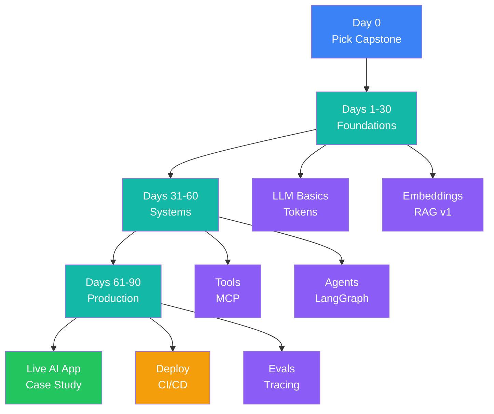
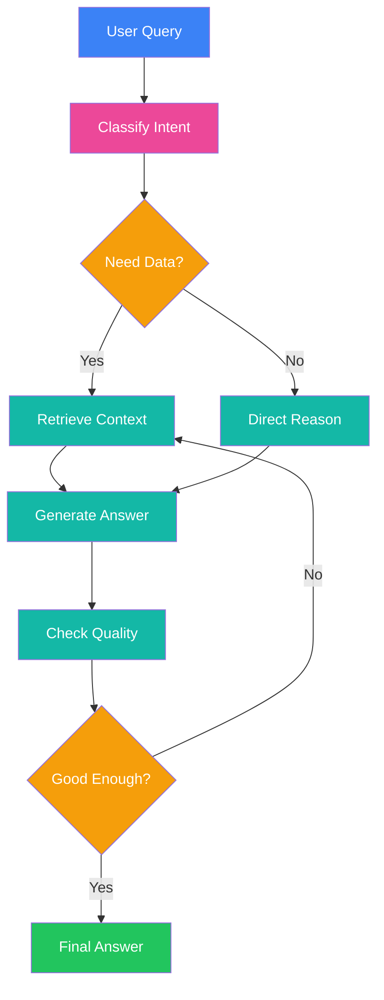
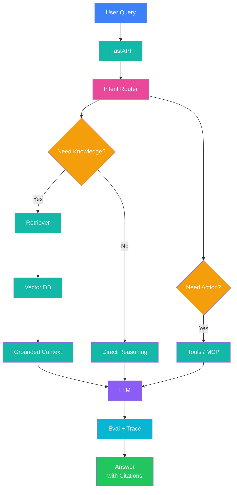

# 90-Day AI Architect Roadmap

Core idea: don’t learn AI randomly.
Use one capstone project for all 90 days.

**Capstone project:** Build a production-ready AI assistant over your own docs, PDFs, repo, or cloud reports.
It should support RAG, citations, tool calling, evals, tracing, deployment, and basic security.

## Daily rhythm

Spend **90–120 minutes daily**.

**20 min:** read/watch.
**60–80 min:** build.
**10–20 min:** write notes, errors, decisions, and next steps.

Do not start 10 projects.
One project. Better every week.

---

# Phase 1: Days 1–30 — Foundations

Goal: understand how LLM apps actually work before jumping into agents.

## Week 1: LLM mental model

**Learn:** tokens, context window, next-token prediction, temperature, system prompt, hallucination, model limits.

**Read/watch:**
[Karpathy: Deep Dive into LLMs](https://www.youtube.com/watch?v=7xTGNNLPyMI)
[Hugging Face LLM Course](https://huggingface.co/learn/llm-course/en/chapter1/1)
([YouTube][1])

**Build:**
Create a small `llm-playground` script.

Test:

* same prompt with different models
* short context vs long context
* temperature 0 vs higher temperature
* JSON output failures
* hallucination examples

**Output:**
One markdown note: “How LLMs work in simple words.”

---

## Week 2: Prompting and structured outputs

**Learn:** role prompting, few-shot prompting, examples, constraints, output schemas, refusal handling.

**Read:**
[OpenAI Prompt Engineering](https://platform.openai.com/docs/guides/prompt-engineering)
[Anthropic Prompt Engineering](https://docs.anthropic.com/en/docs/build-with-claude/prompt-engineering/overview)
[OpenAI Structured Outputs](https://platform.openai.com/docs/guides/structured-outputs)
([OpenAI Platform][2])

**Build:**
Create 20 prompt test cases.

Example:

* summarize text
* extract JSON
* classify intent
* generate follow-up questions
* refuse unsafe input
* return citations only when context exists

**Output:**
A reusable prompt checklist:

* input format
* role
* task
* constraints
* output format
* failure behavior

---

## Week 3: Embeddings and semantic search

**Learn:** embeddings, vector search, chunking, metadata, cosine similarity, retrieval quality.

**Read:**
[OpenAI Embeddings](https://developers.openai.com/api/docs/guides/embeddings)
[Qdrant Documentation](https://qdrant.tech/documentation/)
([OpenAI Developers][3])

**Build:**
Take 50–100 documents or markdown files.

Create:

* document loader
* chunker
* embedding pipeline
* vector database collection
* semantic search endpoint

**Output:**
A `/search?q=` API that returns top matching chunks with source names.

---

## Week 4: RAG v1

**Learn:** retrieval, grounding, citations, answer generation, “I don’t know” behavior. RAG combines retrieval with LLM generation so answers can be grounded in external/private data. ([Microsoft Learn][4])

**Read:**
[Microsoft RAG Concepts](https://learn.microsoft.com/en-us/azure/foundry/concepts/retrieval-augmented-generation)
[LangChain RAG Tutorial](https://python.langchain.com/docs/tutorials/rag/)
[LlamaIndex Starter Tutorial](https://developers.llamaindex.ai/python/framework/getting_started/starter_example/)
([Microsoft Learn][4])

**Build:**
Turn semantic search into a chat app.

Must support:

* user question
* retrieve top chunks
* pass only relevant context
* answer with citations
* say “not found in provided docs” when needed

**Day 30 output:**
A working local “Chat with my docs” app.

---

# Phase 2: Days 31–60 — Systems

Goal: move from scripts to real AI system design.

## Week 5: RAG quality

**Learn:** chunk size, overlap, metadata filters, hybrid search, reranking, retrieval evaluation.

**Read:**
[Qdrant Hybrid Queries](https://qdrant.tech/documentation/)
[Ragas RAG Evaluation](https://docs.ragas.io/en/stable/getstarted/rag_eval/)
([Qdrant][5])

**Build:**
Create a `tests/test_queries.json`.

Each test should include:

* question
* expected source
* expected answer points
* difficulty level

Track:

* Recall@K
* Precision@K
* MRR
* answer relevance
* citation correctness

**Output:**
A basic retrieval evaluation report.

---

## Week 6: Tool calling and MCP

**Learn:** function calling, tool schemas, tool selection, tool safety, MCP basics.

**Read:**
[OpenAI Function Calling](https://developers.openai.com/api/docs/guides/function-calling)
[OpenAI Tools Guide](https://developers.openai.com/api/docs/guides/tools)
[Model Context Protocol Intro](https://modelcontextprotocol.io/introduction)
([OpenAI Developers][6])

**Build:**
Add tools to your assistant.

Examples:

* `search_docs(query)`
* `get_document(id)`
* `summarize_document(id)`
* `create_ticket(summary)`
* `calculate_cost(input)`

Rules:

* tools must have strict schemas
* no destructive action without confirmation
* tool output must be treated as data, not instructions

**Output:**
Assistant can choose between retrieval and tool use.

---

## Week 7: Agent workflows

**Learn:** routing, state, planning, retries, human approval, failure handling. LangGraph is designed for long-running, stateful workflows and agents. ([LangChain Docs][7])

**Read:**
[LangGraph Overview](https://docs.langchain.com/oss/python/langgraph/overview)
[Hugging Face Agents Course](https://huggingface.co/learn/agents-course/en/unit0/introduction)
([LangChain Docs][7])

**Build:**
Create a LangGraph flow:

**Output:**
A real multi-step assistant, not a single prompt wrapper.

---

## Week 8: Evals and reliability

**Learn:** test cases, metrics, evaluation datasets, LLM-as-judge, regression tests. DeepEval describes LLM evaluation around test cases, metrics, and evaluation datasets; LangSmith also provides evaluation workflows. ([DeepEval][8])

**Read:**
[OpenAI Evals](https://platform.openai.com/docs/guides/evals)
[LangSmith Evaluation](https://docs.langchain.com/langsmith/evaluation)
[DeepEval Quickstart](https://deepeval.com/docs/getting-started)
([OpenAI Platform][9])

**Build:**
Create automated evals for:

* retrieval correctness
* answer groundedness
* citation quality
* tool selection
* refusal behavior
* latency
* token cost

**Day 60 output:**
An AI system with tests, not just a demo.

---

# Phase 3: Days 61–90 — Production

Goal: ship something real and show production judgment.

## Week 9: Backend and API

**Learn:** API design, request validation, streaming responses, async jobs, error handling.

**Read:**
[FastAPI First Steps](https://fastapi.tiangolo.com/tutorial/first-steps/)
[FastAPI User Guide](https://fastapi.tiangolo.com/tutorial/)
([FastAPI][10])

**Build:**
Create production-style endpoints:

* `POST /chat`
* `POST /documents/upload`
* `GET /documents`
* `POST /evals/run`
* `GET /health`
* `GET /usage`

**Output:**
Your assistant runs behind a clean API.

---

## Week 10: Docker and CI/CD

**Learn:** containers, environment variables, secrets, build pipeline, deployment pipeline. GitHub Actions is used for CI/CD workflows such as building, testing, and deployment. ([GitHub Docs][11])

**Read:**
[Docker Get Started](https://docs.docker.com/get-started/)
[GitHub Actions Quickstart](https://docs.github.com/en/actions/get-started/quickstart)
([Docker Documentation][12])

**Build:**
Add:

* `Dockerfile`
* `.env.example`
* `docker-compose.yml`
* GitHub Actions workflow
* unit tests
* eval test job
* deployment script

**Output:**
Every push can run tests and build the app.

---

## Week 11: Observability and cost tracking

**Learn:** traces, logs, metrics, token usage, latency, cost per request, failure reasons. LangSmith provides LLM app observability from traces to production metrics; OpenTelemetry is a vendor-neutral framework for traces, metrics, and logs. ([LangChain Docs][13])

**Read:**
[LangSmith Observability](https://docs.langchain.com/langsmith/observability)
[OpenTelemetry Docs](https://opentelemetry.io/docs/)
([LangChain Docs][14])

**Build:**
Track:

* prompt tokens
* completion tokens
* total cost
* tool calls
* retrieval latency
* model latency
* failed requests
* eval score per response

**Output:**
A dashboard or log view that explains what happened inside the AI system.

---

## Week 12: Security and guardrails

**Learn:** prompt injection, data leakage, insecure output handling, excessive agency, tool abuse. OWASP maintains a Top 10 list for LLM and generative AI application risks. ([OWASP Gen AI Security Project][15])

**Read:**
[OWASP Top 10 for LLM Applications](https://genai.owasp.org/llm-top-10/)
[OpenAI Safety Best Practices](https://platform.openai.com/docs/guides/safety-best-practices)
([OWASP Gen AI Security Project][15])

**Build:**
Add:

* prompt injection test set
* tool allowlist
* confirmation before write actions
* context isolation
* secret redaction
* safe fallback response
* rate limiting
* audit logs

**Output:**
Your app is harder to break and safer to demo.

---

## Days 85–90: Launch and case study

**Build final assets:**

1. Live app link
2. GitHub repo or private demo repo
3. README
4. Architecture diagram
5. Eval report
6. Demo video
7. “What I learned” case study
8. Known limitations
9. Next version roadmap

**Final acceptance criteria:**

Your AI app should:

* answer from your own data
* cite sources
* use tools when needed
* avoid unsupported answers
* run evals
* show traces
* track cost
* deploy from CI/CD
* handle basic prompt injection attempts
* explain failures clearly

---

# Final architecture

# What to avoid

Do not start with fine-tuning.
Do not build agents before understanding RAG.
Do not ship without evals.
Do not trust model output without grounding.
Do not give tools unlimited permissions.

The goal is not “learn AI.”
The goal is to become the engineer who can design, debug, ship, and explain AI systems.

[1]: https://www.youtube.com/watch?v=7xTGNNLPyMI&utm_source=chatgpt.com "Deep Dive into LLMs like ChatGPT"
[2]: https://platform.openai.com/docs/guides/prompt-engineering "Prompt engineering | OpenAI API"
[3]: https://developers.openai.com/api/docs/guides/embeddings?utm_source=chatgpt.com "Vector embeddings | OpenAI API"
[4]: https://learn.microsoft.com/en-us/azure/foundry/concepts/retrieval-augmented-generation?utm_source=chatgpt.com "Retrieval augmented generation (RAG) and indexes"
[5]: https://qdrant.tech/documentation/ "Documentation - Qdrant"
[6]: https://developers.openai.com/api/docs/guides/function-calling "Function calling | OpenAI API"
[7]: https://docs.langchain.com/oss/python/langgraph/overview?utm_source=chatgpt.com "LangGraph overview - Docs by LangChain"
[8]: https://deepeval.com/docs/evaluation-introduction?utm_source=chatgpt.com "Introduction to LLM Evals | DeepEval by Confident AI"
[9]: https://platform.openai.com/docs/guides/evals "Working with evals | OpenAI API"
[10]: https://fastapi.tiangolo.com/tutorial/first-steps/?utm_source=chatgpt.com "First Steps"
[11]: https://docs.github.com/en/actions/get-started/quickstart?utm_source=chatgpt.com "Quickstart for GitHub Actions"
[12]: https://docs.docker.com/get-started/?utm_source=chatgpt.com "Get started | Docker Docs"
[13]: https://docs.langchain.com/langsmith/observability?utm_source=chatgpt.com "LangSmith Observability - Docs by LangChain"
[14]: https://docs.langchain.com/langsmith/observability "LangSmith Observability - Docs by LangChain"
[15]: https://genai.owasp.org/llm-top-10/?utm_source=chatgpt.com "LLMRisks Archive - OWASP Gen AI Security Project"
